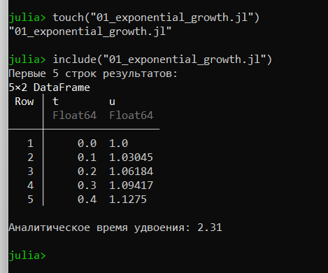
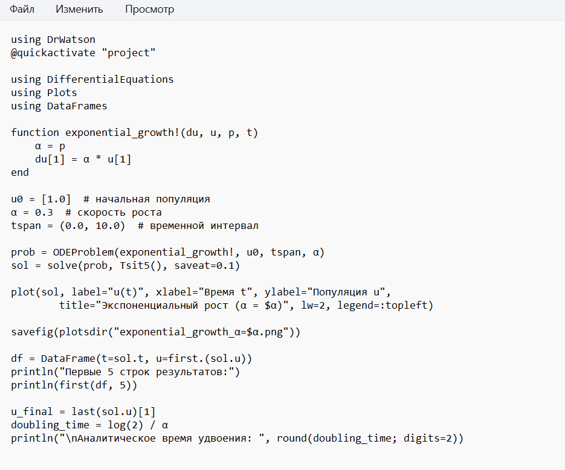
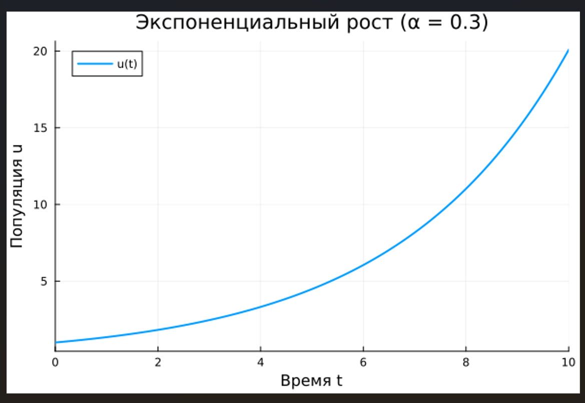
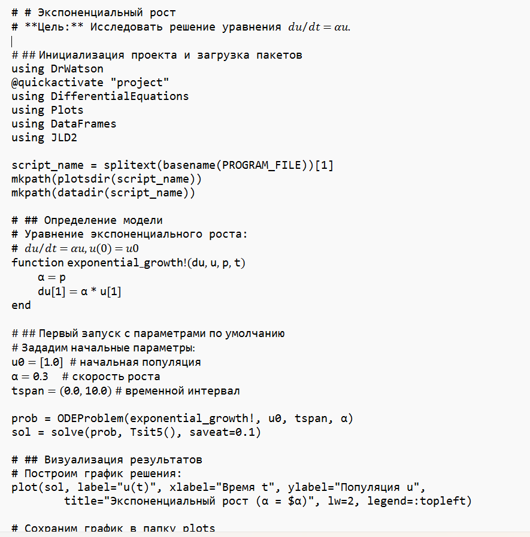
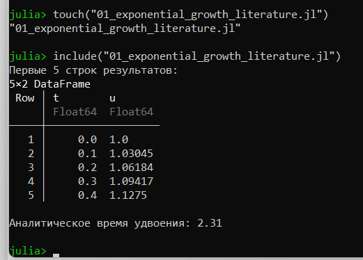
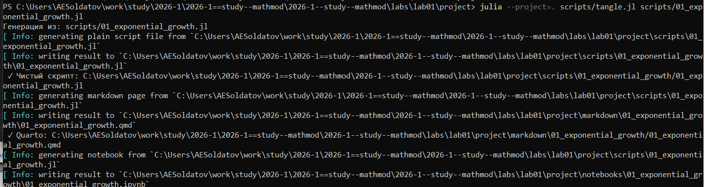
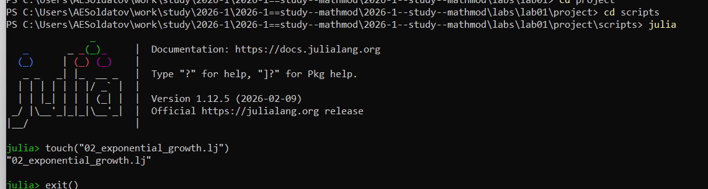
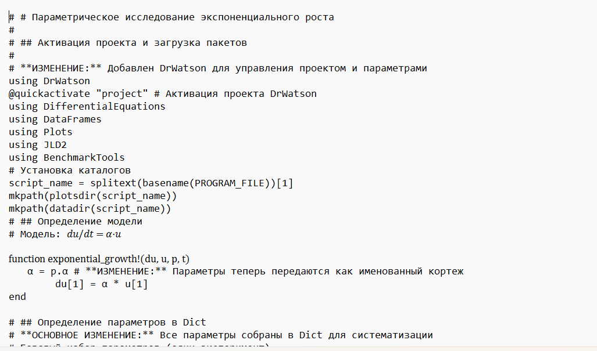
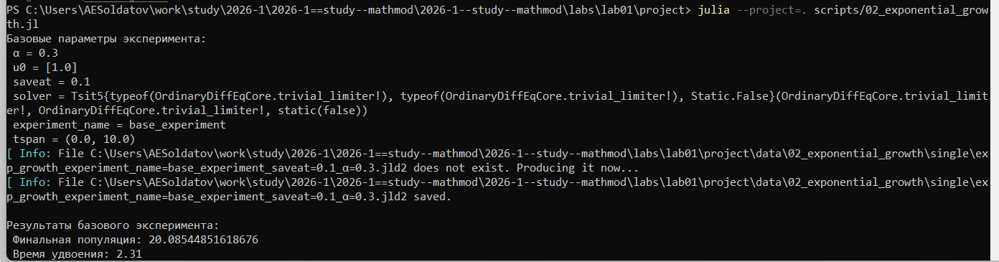
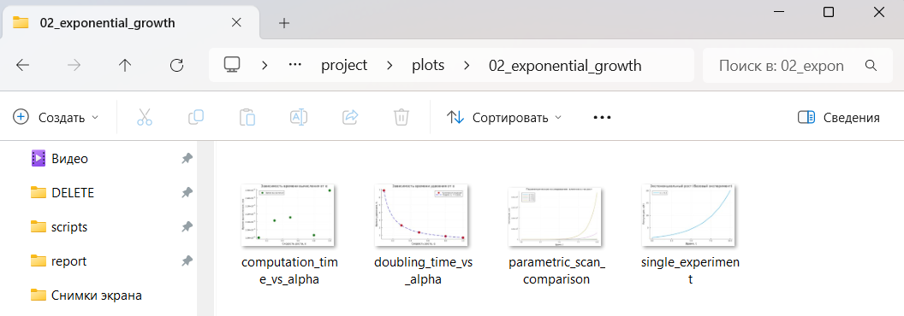

---
## Author
author:
  name: Солдатов Алексей
  degrees: Студент
  orcid: 0000-0002-0877-7063
  email: 1132236009@pfur.ru
  affiliation:
    - name: Российский университет дружбы народов
      country: Российская Федерация
      postal-code: 117198
      city: Москва
      address: ул. Миклухо-Маклая, д. 6

## Title
title: "Лабораторная работа №1"
---

# Цель работы

Настроить каталог курса и создать рабочее пространство, а также познакомиться с ЯП Julia

# Задание

Выполнить предложенный код

# Теоретическое введение

Здесь описываются теоретические аспекты, связанные с выполнением работы.

Например, в [табл. @tbl-std-dir] приведено краткое описание стандартных каталогов Unix.

| Имя каталога | Описание каталога                                                                                                          |
|--------------|----------------------------------------------------------------------------------------------------------------------------|
| `/`          | Корневая директория, содержащая всю файловую                                                                               |
| `/bin `      | Основные системные утилиты, необходимые как в однопользовательском режиме, так и при обычной работе всем пользователям     |
| `/etc`       | Общесистемные конфигурационные файлы и файлы конфигурации установленных программ                                           |
| `/home`      | Содержит домашние директории пользователей, которые, в свою очередь, содержат персональные настройки и данные пользователя |
| `/media`     | Точки монтирования для сменных носителей                                                                                   |
| `/root`      | Домашняя директория пользователя  `root`                                                                                   |
| `/tmp`       | Временные файлы                                                                                                            |
| `/usr`       | Вторичная иерархия для данных пользователя                                                                                 |

: Описание некоторых каталогов файловой системы GNU Linux {#tbl-std-dir}

Более подробно про Unix см. в [@tanenbaum_book_modern-os_ru; @robbins_book_bash_en; @zarrelli_book_mastering-bash_en; @newham_book_learning-bash_en].

# Выполнение лабораторной работы

Предварительно настроил git, установил все необходимые пакеты и настроил зависимости, а также протестировал работу программы через тестовый скрипт, предложенный в работе

Создал скрипт "scripts/01_exponential_growth.jl" ([рис. @fig-001]).

{#fig-001 width=70%}

Прописал код скрипта ([рис. @fig-002]).

{#fig-002 width=70%}

Посмотрел график ([рис. @fig-003]).

{#fig-003 width=70%}

Переписал данный скрипт в литературном формате ([рис. @fig-004]).

{#fig-004 width=70%}

Выполнил переделанный скрипт ([рис. @fig-005]).

{#fig-005 width=70%}

Выполнил скрипт для генерации производных форматов "tangle.jl" ([рис. @fig-006]).

{#fig-006 width=70%}

Создал скрипт "scripts/02_exponential_growth.jl" ([рис. @fig-007]).

{#fig-007 width=70%}

Прописал код скрипта ([рис. @fig-008]).

{#fig-008 width=70%}

Выполнил скрипт ([рис. @fig-009]).

{#fig-009 width=70%}

Посмотрел созданные графики ([рис. @fig-010]).

{#fig-010 width=70%}

# Выводы

Познакомился с ЯП Julia

# Список литературы{.unnumbered}

::: {#refs}
:::
