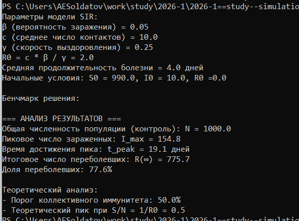
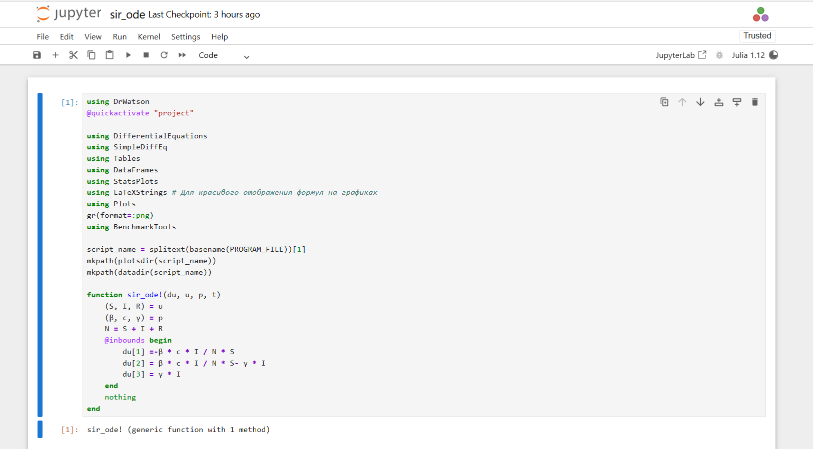
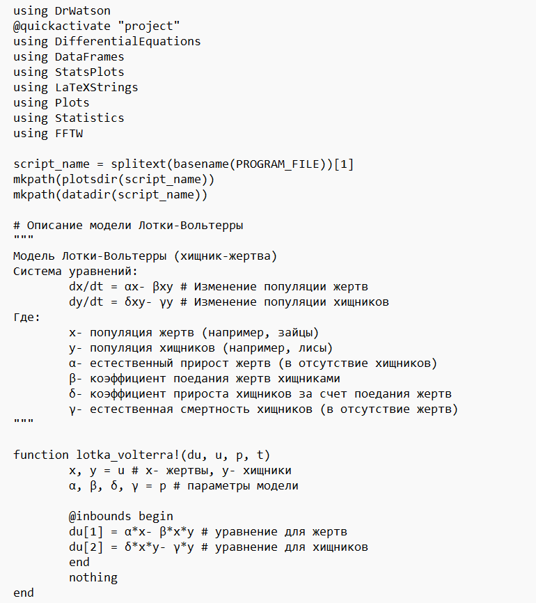
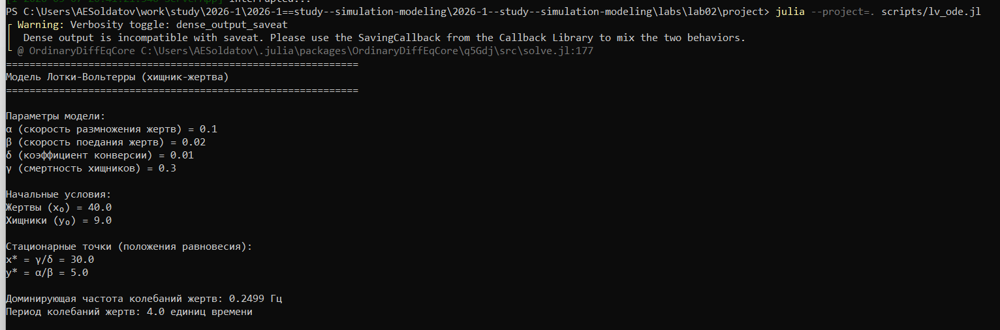
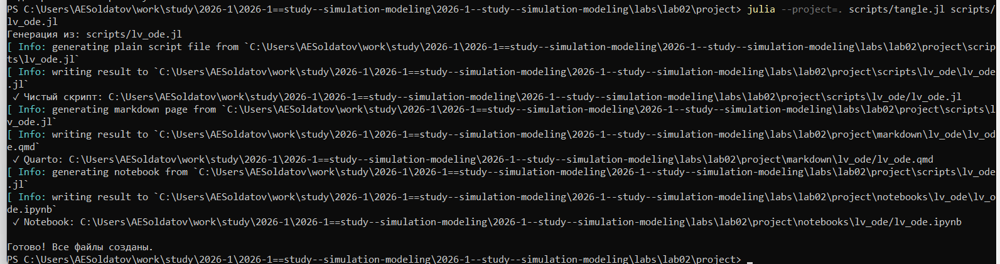
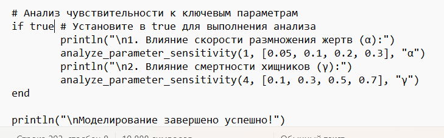

---
## Author
author:
  name: Солдатов Алексей
  degrees: Студент
  email: 1132236009@pfur.ru
  affiliation:
    - name: Российский университет дружбы народов
      country: Российская Федерация
      postal-code: 117198
      city: Москва
      address: ул. Миклухо-Маклая, д. 6

## Title
title: Лабораторная работа №2
subtitle: Имитационное моделирование
---

## Докладчик

:::::::::::::: {.columns align=center}
::: {.column width="70%"}

Солдатов Алексей Евгеньевич

Студент 3го курса

Российский университет дружбы народов им. П. Лумумбы
:::
::: {.column width="30%"}

:::
::::::::::::::

# Выполнение ЛР2

## Создал рабочий каталог ([рис. @fig-001]).

{#fig-001 width=70%}

## Установил необходимые пакеты ([рис. @fig-002]).

{#fig-002 width=70%}

## Написал предложенный код ([рис. @fig-003]).

{#fig-003 width=70%}

## Выполнил предложенный код ([рис. @fig-004]).

{#fig-004 width=70%}

## Сгенерировал необходимые форматы из литературного кода ([рис. @fig-005]).

{#fig-005 width=70%}

## Выполнил код из jupyter notebook ([рис. @fig-006]).

{#fig-006 width=70%}

## Интегрировал документацию в отчет ([рис. @fig-007]).

{#fig-007 width=70%}

## Написал второй предложенный код ([рис. @fig-008]).

{#fig-008 width=70%}

## Выполнил предложенный код ([рис. @fig-009]).

{#fig-009 width=70%}

## Сгенерировал необходимые форматы из литературного кода ([рис. @fig-010]).

{#fig-010 width=70%}

## Выполнил код из jupyter notebook ([рис. @fig-011]).

{#fig-011 width=70%}

## Добавил в код в литературном стиле вычисление для набора параметров ([рис. @fig-012]).

{#fig-012 width=70%}

## Выполнил измененный код ([рис. @fig-013]).

{#fig-013 width=70%}

## Выполнил измененный код из jupyter notebook ([рис. @fig-014]).

{#fig-014 width=70%}

## Интегрировал документацию второго измененного кода в отчет ([рис. @fig-015]).

{#fig-015 width=70%}

# Спасибо за внимание!

