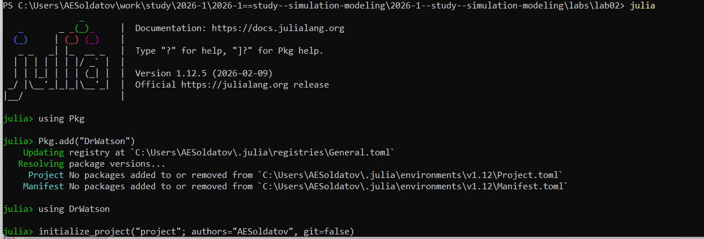
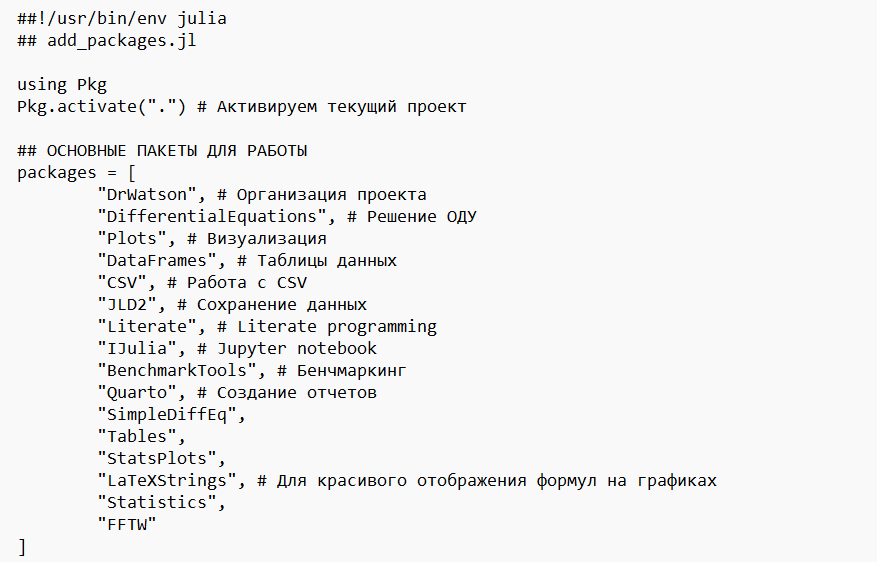
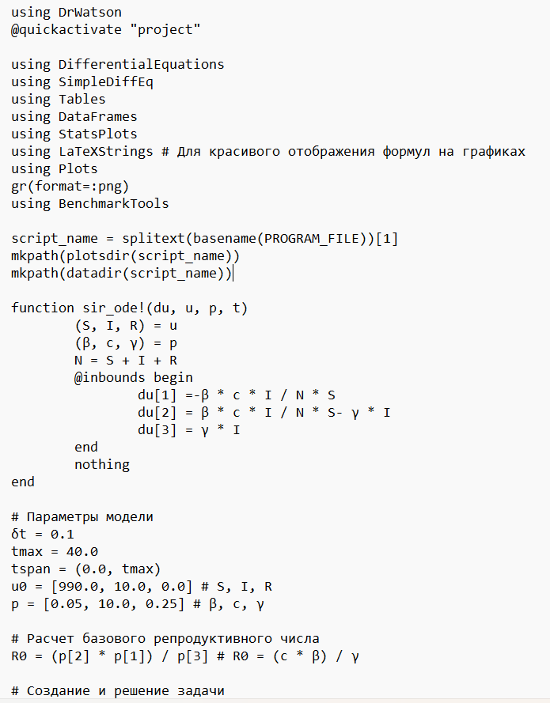
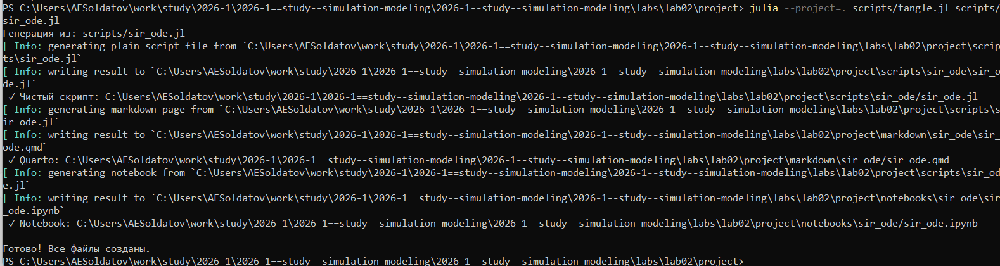
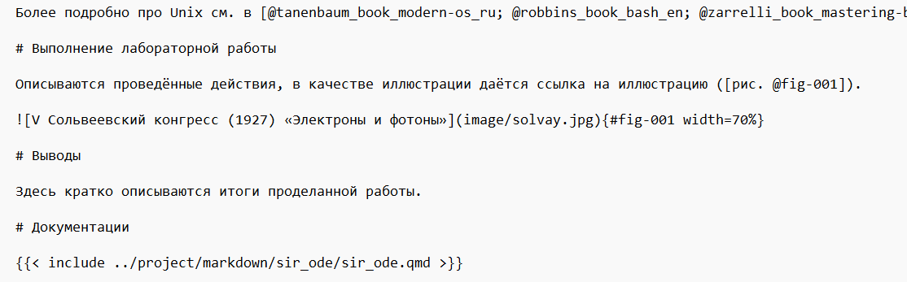
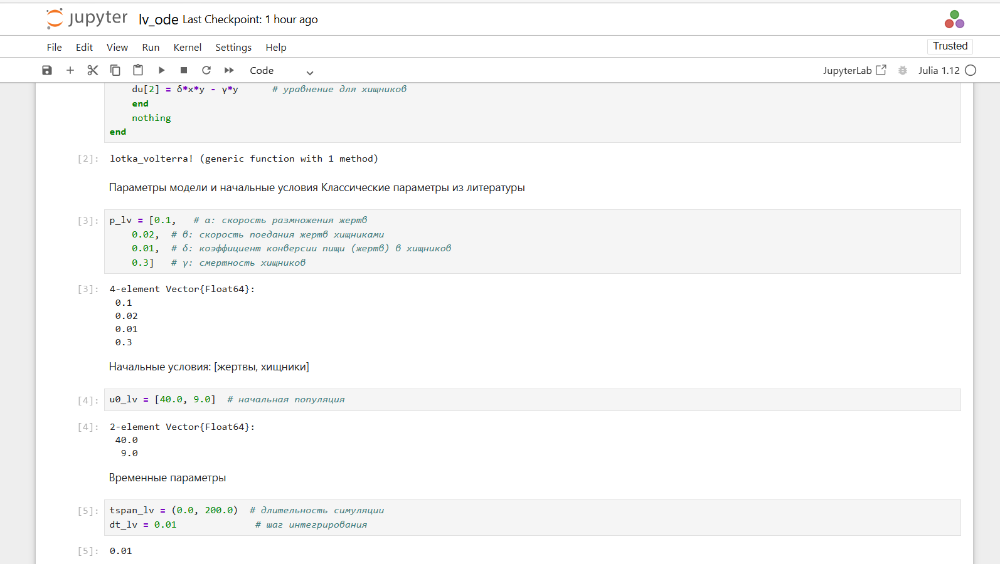
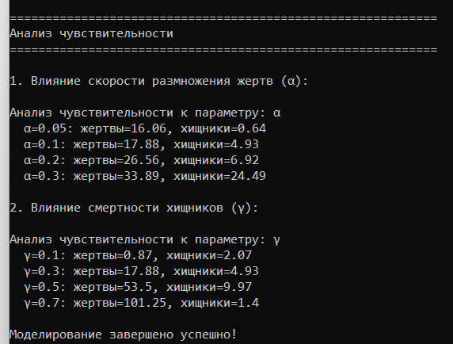
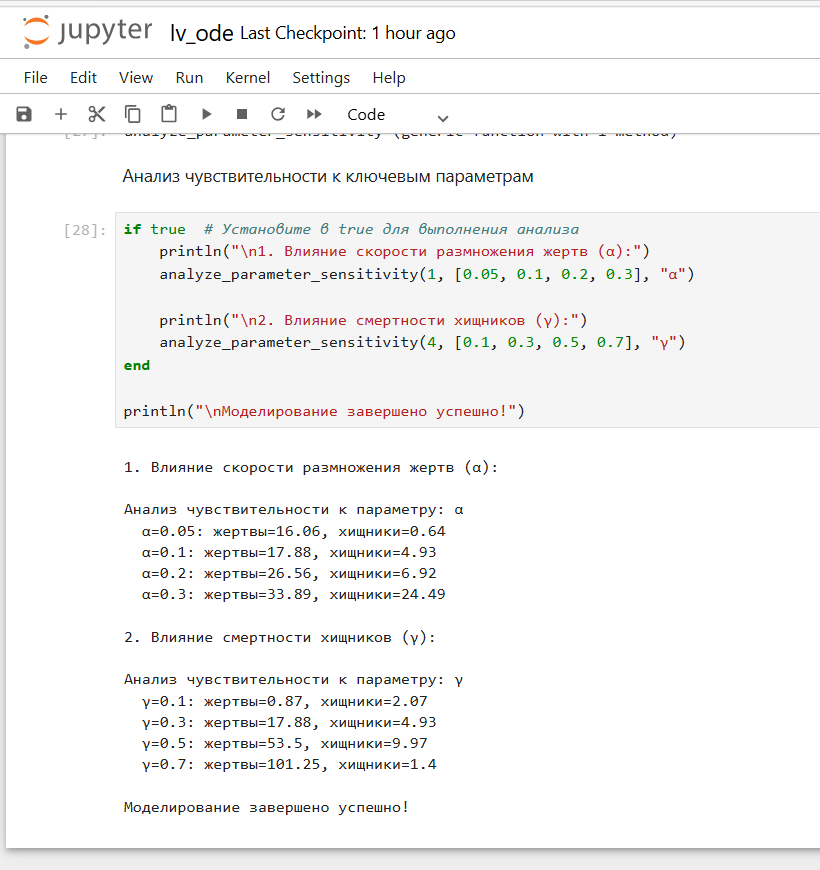
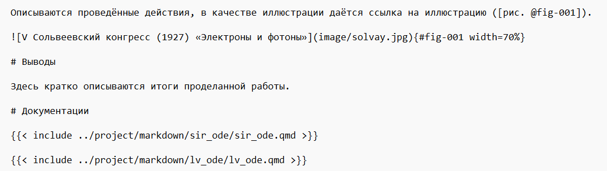

---
## Author
author:
  name: Солдатов Алексей
  degrees: Студент
  email: 1132236009@pfur.ru
  affiliation:
    - name: Российский университет дружбы народов
      country: Российская Федерация
      postal-code: 117198
      city: Москва
      address: ул. Миклухо-Маклая, д. 6

## Title
title: "Лабораторная работа №2"
---

# Цель работы

Узнать новые имитационные модели выполить поставленные задачи.

# Задание

— Создать рабочий каталог для кода.
— Установить необходимые пакеты.
— Выполнить предложенный код.
— Преобразовать код в литературный стиль.
— Сгенерировать из литературного кода:
	— чистый код;
	— jupyter notebook;
	— документацию в формате Quarto.
— Выполнить код из jupyter notebook.
— Интегрировать документацию в формате Quarto в отчёт.
— Добавить в код в литературном стиле вычисление для набора параметров.
— Сгенерировать из литературного кода с параметрами:
	— чистый код;
	— jupyter notebook;
	— документацию в формат еQuarto.
— Выполнить код из jupyter notebook с параметрами.
— Интегрировать документацию с параметрами вформате Quarto в отчёт.

# Теоретическое введение

Здесь описываются теоретические аспекты, связанные с выполнением работы.

Например, в [табл. @tbl-std-dir] приведено краткое описание стандартных каталогов Unix.

| Имя каталога | Описание каталога                                                                                                          |
|--------------|----------------------------------------------------------------------------------------------------------------------------|
| `/`          | Корневая директория, содержащая всю файловую                                                                               |
| `/bin `      | Основные системные утилиты, необходимые как в однопользовательском режиме, так и при обычной работе всем пользователям     |
| `/etc`       | Общесистемные конфигурационные файлы и файлы конфигурации установленных программ                                           |
| `/home`      | Содержит домашние директории пользователей, которые, в свою очередь, содержат персональные настройки и данные пользователя |
| `/media`     | Точки монтирования для сменных носителей                                                                                   |
| `/root`      | Домашняя директория пользователя  `root`                                                                                   |
| `/tmp`       | Временные файлы                                                                                                            |
| `/usr`       | Вторичная иерархия для данных пользователя                                                                                 |

: Описание некоторых каталогов файловой системы GNU Linux {#tbl-std-dir}

Более подробно про Unix см. в [@tanenbaum_book_modern-os_ru; @robbins_book_bash_en; @zarrelli_book_mastering-bash_en; @newham_book_learning-bash_en].

# Выполнение лабораторной работы

Создал рабочий каталог ([рис. @fig-001]).

{#fig-001 width=70%}

Установил необходимые пакеты ([рис. @fig-002]).

{#fig-002 width=70%}

Написал предложенный код ([рис. @fig-003]).

{#fig-003 width=70%}

Выполнил предложенный код ([рис. @fig-004]).

{#fig-004 width=70%}

Сгенерировал необходимые форматы из литературного кода ([рис. @fig-005]).

{#fig-005 width=70%}

Выполнил код из jupyter notebook ([рис. @fig-006]).

{#fig-006 width=70%}

Интегрировал документацию в отчет ([рис. @fig-007]).

{#fig-007 width=70%}

Написал второй предложенный код ([рис. @fig-008]).

{#fig-008 width=70%}

Выполнил предложенный код ([рис. @fig-009]).

{#fig-009 width=70%}

Сгенерировал необходимые форматы из литературного кода ([рис. @fig-010]).

{#fig-010 width=70%}

Выполнил код из jupyter notebook ([рис. @fig-011]).

{#fig-011 width=70%}

Добавил в код в литературном стиле вычисление для набора параметров ([рис. @fig-012]).

{#fig-012 width=70%}

Выполнил измененный код ([рис. @fig-013]).

{#fig-013 width=70%}

Выполнил измененный код из jupyter notebook ([рис. @fig-014]).

{#fig-014 width=70%}

Интегрировал документацию второго измененного кода в отчет ([рис. @fig-015]).

{#fig-015 width=70%}

# Выводы

Узнал новые имитационные модели.

Выполнил поставленные задачи.

# Документации





# Список литературы{.unnumbered}

::: {#refs}
:::
