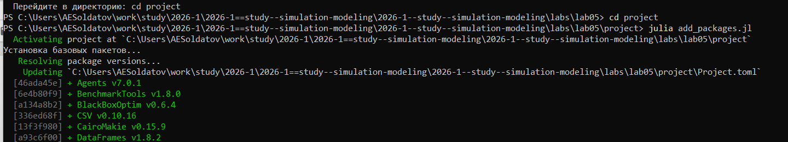
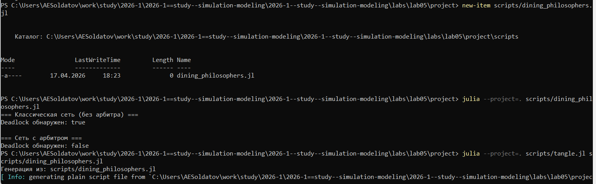
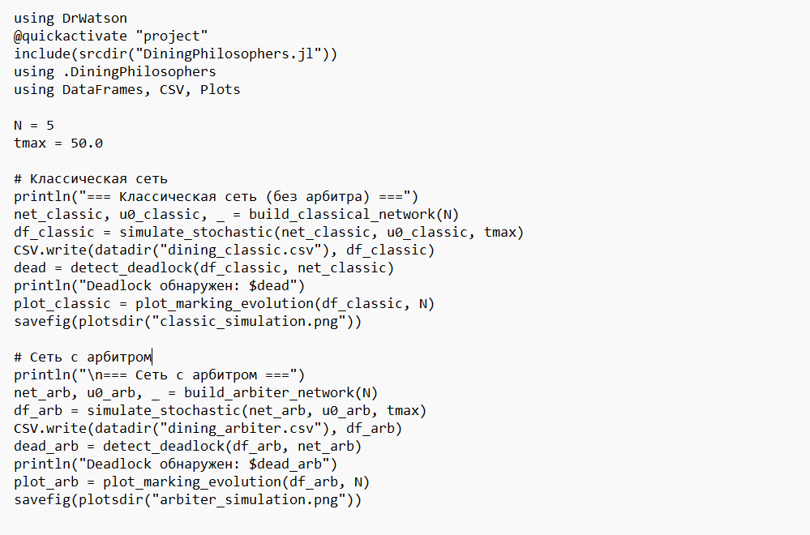
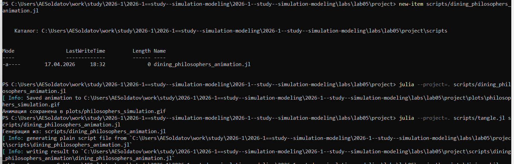
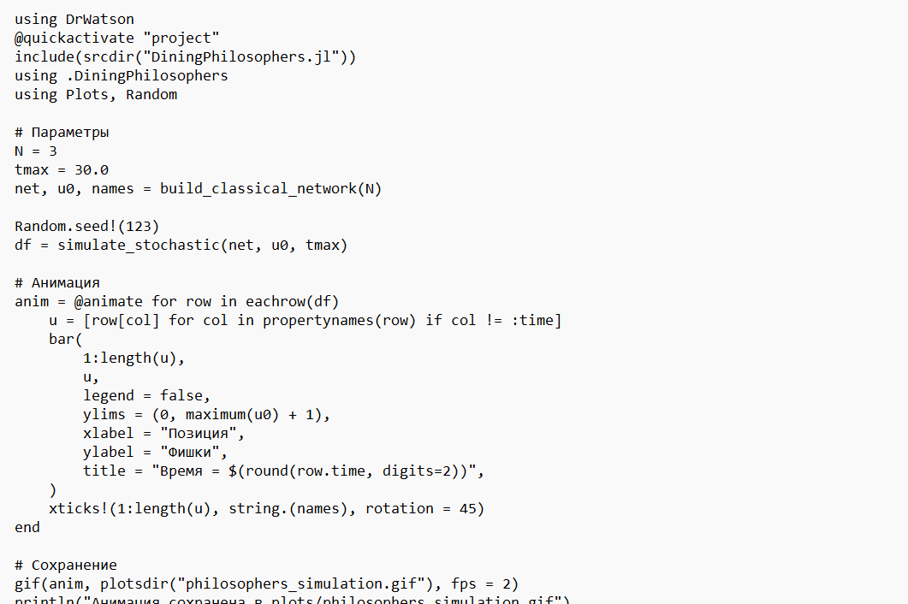
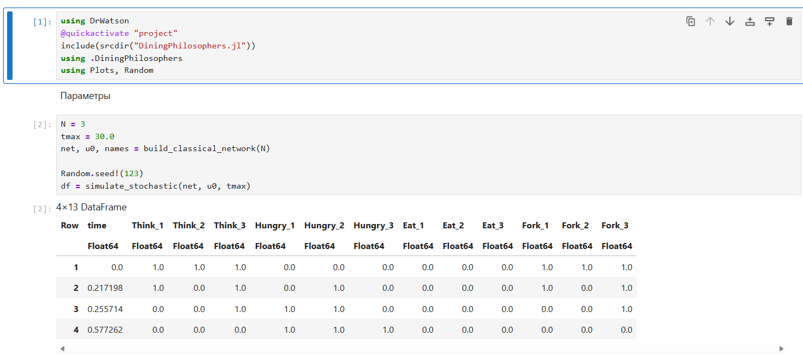
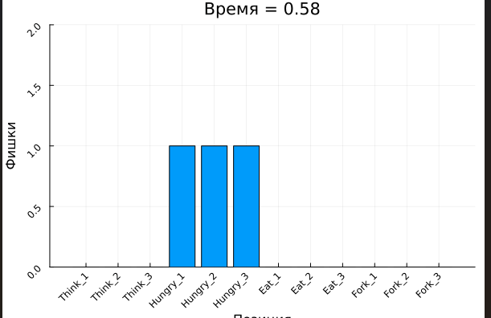
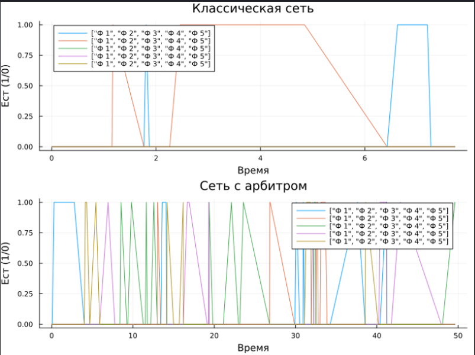
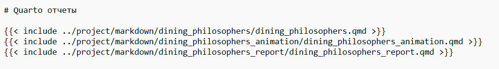

---
## Author
author:
  name: Солдатов Алексей
  degrees: Студент
  email: 1132236009@pfur.ru
  affiliation:
    - name: Российский университет дружбы народов
      country: Российская Федерация
      postal-code: 117198
      city: Москва
      address: ул. Миклухо-Маклая, д. 6

## Title
title: Лабораторная работа №5
subtitle: Имитационное моделирование
---

## Докладчик

:::::::::::::: {.columns align=center}
::: {.column width="70%"}

Солдатов Алексей Евгеньевич

Студент 3го курса

Российский университет дружбы народов им. П. Лумумбы
:::
::: {.column width="30%"}

:::
::::::::::::::

# Выполнение лабораторной работы

## Зашел в папку с лабораторной работой и запустил проект Julia ([рис. @fig-001]).

{#fig-001 width=70%}

## Перешел в каталог проекта и установил необходимые пакеты ([рис. @fig-002]).

{#fig-002 width=70%}

## Создал файл "src/DiningPhilosophers.jl" ([рис. @fig-003]).

{#fig-003 width=70%}

## Написал предложенный код ([рис. @fig-004]).

{#fig-004 width=70%}

## Создал файл "scripts/dining_philosophers.jl", запустил его и потом сгенерировал производные форматы ([рис. @fig-005]).

{#fig-005 width=70%}

## Написал предложенный код ([рис. @fig-006]).

{#fig-006 width=70%}

## Проверил создание графика с арбитром ([рис. @fig-061]).

{#fig-061 width=70%}

## Проверил создание графика классической сети ([рис. @fig-062]).

{#fig-062 width=70%}

## Запустил блокнот в jupyter notebook ([рис. @fig-007]).

{#fig-007 width=70%}

## Создал файл "scripts/dining_philosophers_animation.jl", запустил его и сгенерировал производные форматы ([рис. @fig-008]).

{#fig-008 width=70%}

## Написал предложенный код ([рис. @fig-009]).

{#fig-009 width=70%}

## Запустил блокнот в jupyter notebook ([рис. @fig-010]).

{#fig-010 width=70%}

## Проверил создание анимации ([рис. @fig-101]).

{#fig-101 width=70%}

## Создал файл "scripts/dining_philosophers_report.jl", запустил его и сгенерировал производные форматы ([рис. @fig-011]).

{#fig-011 width=70%}

## Вот предложенный код ([рис. @fig-012]).

{#fig-012 width=70%}

## Выполнил код из jupyter notebook ([рис. @fig-013]).

{#fig-013 width=70%}

## Проверил создание графика([рис. @fig-131]).

{#fig-131 width=70%}

## Проверил, наличие всех ссылок на Quarto отчеты ([рис. @fig-014]).

{#fig-014 width=70%}

## Выводы
- Познакомился с сетями петри
- Выполнил все поставленные задачи.

# Спасибо за внимание!