---
## Author
author:
  name: Солдатов Алексей
  degrees: Студент
  email: 1132236009@pfur.ru
  affiliation:
    - name: Российский университет дружбы народов
      country: Российская Федерация
      postal-code: 117198
      city: Москва
      address: ул. Миклухо-Маклая, д. 6

## Title
title: Лабораторная работа №7
subtitle: Имитационное моделирование
---

## Докладчик

:::::::::::::: {.columns align=center}
::: {.column width="70%"}

Солдатов Алексей Евгеньевич

Студент 3го курса

Российский университет дружбы народов им. П. Лумумбы
:::
::: {.column width="30%"}

:::
::::::::::::::

# Выполнение лабораторной работы №7

## Зашел в папку с лабораторной работой и запустил проект Julia ([рис. @fig-001]).

{#fig-001 width=70%}

## Перешел в папку с проектом и установил необходимые пакеты через скрипт ([рис. @fig-002]).

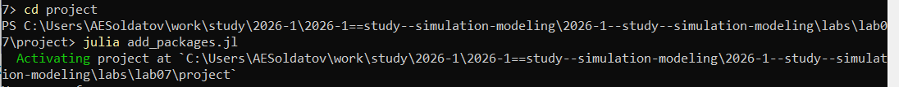{#fig-002 width=70%}

## Согласно структуре DrWatson создал файл модели MMC в папке src и прописал код ([рис. @fig-003]).

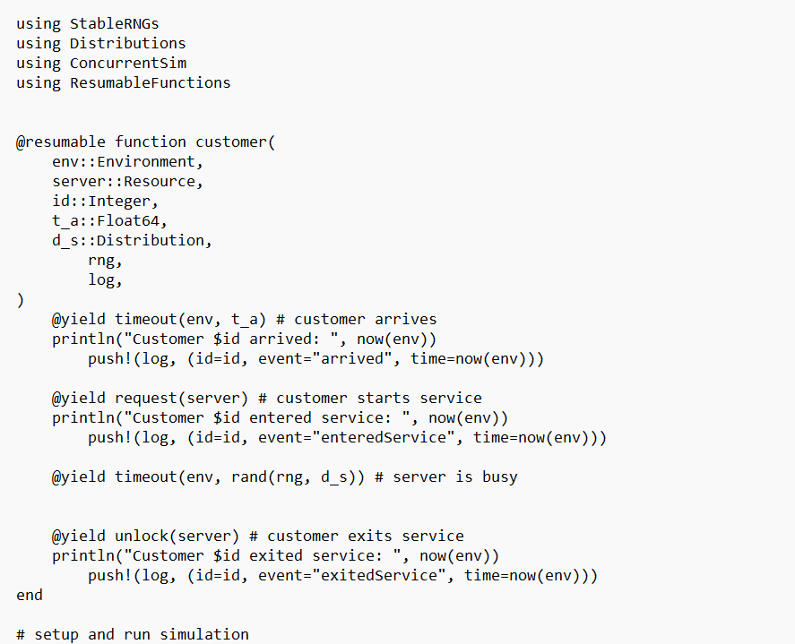{#fig-003 width=70%}

## Согласно структуре DrWatson создал файл запуска прогона симуляции MMC в папке scripts и прописал код ([рис. @fig-004]).

{#fig-004 width=70%}

## Запустил написанный скрипт и посмотрел на результаты ([рис. @fig-005]).

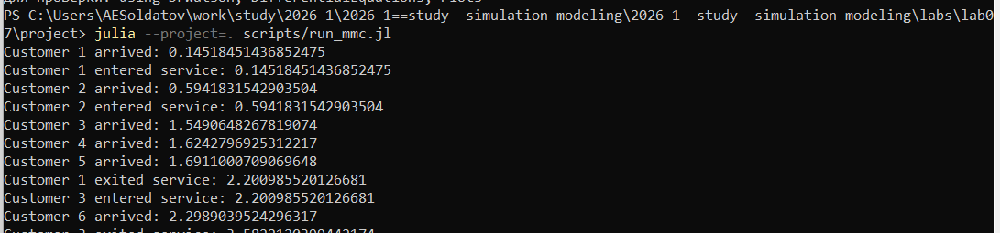{#fig-005 width=70%}

## Динамика числа клиентов в системе ([рис. @fig-61]).

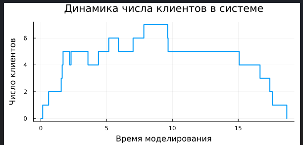{#fig-061 width=70%}

## Время ожидания клиентов ([рис. @fig-62]).

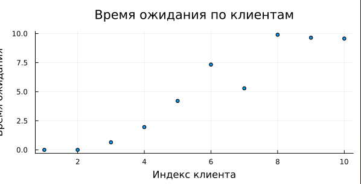{#fig-062 width=70%}

## Количество людей по времени ожидания ([рис. @fig-63]).

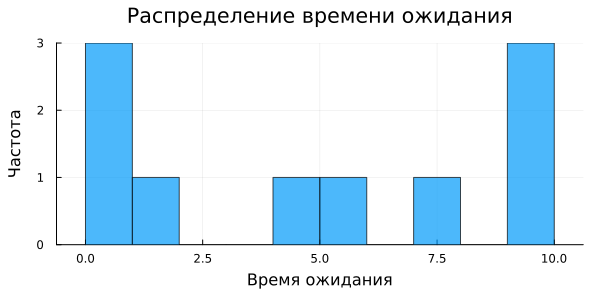{#fig-063 width=70%}

## Создал производные форматы ([рис. @fig-007]).

{#fig-007 width=70%}

## Запустил созданный блокнот в jupyter notebook ([рис. @fig-008]).

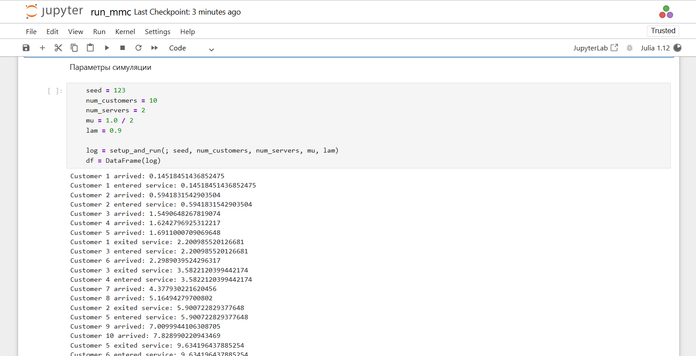{#fig-008 width=70%}

## Согласно структуре DrWatson создал файл модели Росса в папке src и прописал код ([рис. @fig-009]).

{#fig-009 width=70%}

## Согласно структуре DrWatson создал файл запуска прогона симуляции Росса в папке scripts и прописал код ([рис. @fig-010]).

{#fig-010 width=70%}

## Запустил написанный скрипт и посмотрел на результаты ([рис. @fig-011]).

{#fig-011 width=70%}

## Согласно заданию прогнал симуляцию с разным количеством ремонтников ([рис. @fig-012]).

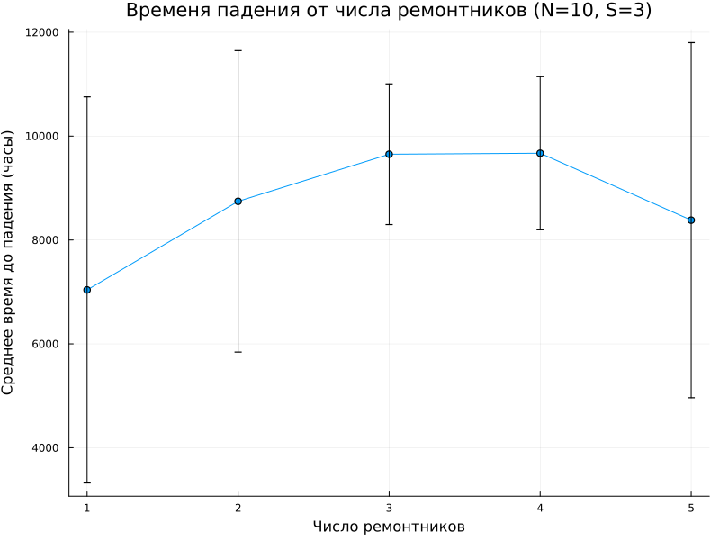{#fig-012 width=70% height=80%}

## Провел симуляцию для разного количества основных машин ([рис. @fig-013]).

{#fig-013 width=70% height=80%}

## Провел симуляцию для разного количества машин резерва ([рис. @fig-014]).

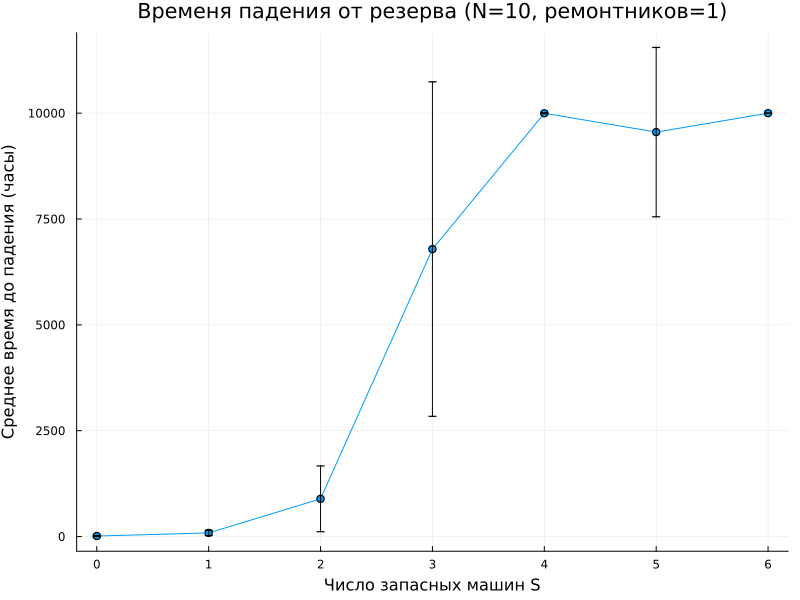{#fig-014 width=70% height=80%}

## Согласно заданию построил график изменения числа исправных машин во времени ([рис. @fig-015]).

{#fig-015 width=70% height=80%}

## Создал производные форматы ([рис. @fig-016]).

{#fig-016 width=70%}

## Запустил созданный блокнот в jupyter notebook ([рис. @fig-017]).

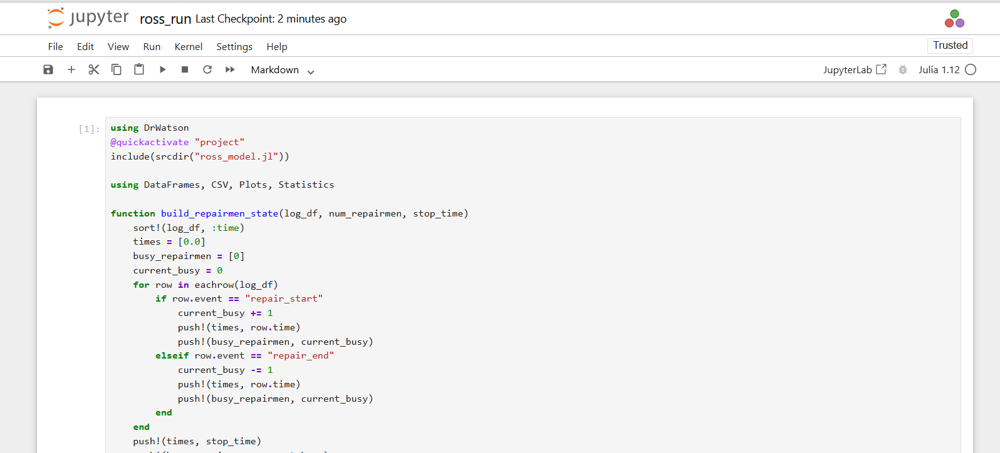{#fig-017 width=70%}

## Интегрировал ссылки на Quarto отчеты в отчет ([рис. @fig-018]).

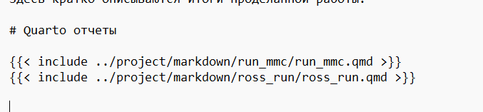{#fig-018 width=70%}

# Выводы

## Выводы

- Познакомился с дискретно-событийным моделированием
- Выполнил все поставленные задачи.

# Спасибо за внимание!

