---
## Author
author:
  name: Солдатов Алексей
  degrees: Студент
  email: 1132236009@pfur.ru
  affiliation:
    - name: Российский университет дружбы народов
      country: Российская Федерация
      postal-code: 117198
      city: Москва
      address: ул. Миклухо-Маклая, д. 6

## Title
title: "Лабораторная работа №8"
---

# Цель работы

Изучить дискретно-событийный подход к имитационному моделированию на примере классической модели распространения инфекции SIR.

# Задание

— Создать рабочий каталог для кода.
— Установить необходимые пакеты.
— Выполнить предложенный код.
— Преобразовать код в литературный стиль.
— Сгенерировать из литературного кода:
	— чистый код;
	— jupyter notebook;
	— документацию в формате Quarto.
— Выполнить код из jupyter notebook.
— Интегрировать документацию в формате Quarto в отчёт.
— Добавить в код в литературном стиле вычисление для набора параметров.
— Сгенерировать из литературного кода с параметрами:
	— чистый код;
	— jupyter notebook;
	— документацию в формат еQuarto.
— Выполнить код из jupyter notebook с параметрами.
— Интегрировать документацию с параметрами вформате Quarto в отчёт.

# Теоретическое введение

Здесь описываются теоретические аспекты, связанные с выполнением работы.

Например, в [табл. @tbl-std-dir] приведено краткое описание стандартных каталогов Unix.

| Имя каталога | Описание каталога                                                                                                          |
|--------------|----------------------------------------------------------------------------------------------------------------------------|
| `/`          | Корневая директория, содержащая всю файловую                                                                               |
| `/bin `      | Основные системные утилиты, необходимые как в однопользовательском режиме, так и при обычной работе всем пользователям     |
| `/etc`       | Общесистемные конфигурационные файлы и файлы конфигурации установленных программ                                           |
| `/home`      | Содержит домашние директории пользователей, которые, в свою очередь, содержат персональные настройки и данные пользователя |
| `/media`     | Точки монтирования для сменных носителей                                                                                   |
| `/root`      | Домашняя директория пользователя  `root`                                                                                   |
| `/tmp`       | Временные файлы                                                                                                            |
| `/usr`       | Вторичная иерархия для данных пользователя                                                                                 |

: Описание некоторых каталогов файловой системы GNU Linux {#tbl-std-dir}

Более подробно про Unix см. в [@tanenbaum_book_modern-os_ru; @robbins_book_bash_en; @zarrelli_book_mastering-bash_en; @newham_book_learning-bash_en].

# Выполнение лабораторной работы

Зашел в папку с лабораторной работой и запустил проект Julia ([рис. @fig-001]).

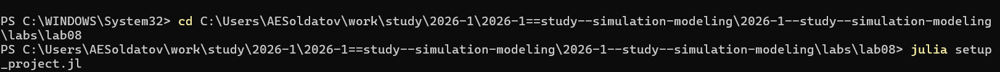{#fig-001 width=70%}

Перешел в папку с проектом и установил необходимые пакеты через скрипт ([рис. @fig-002]).

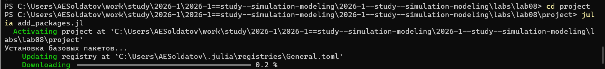{#fig-002 width=70%}

Создал файл для ядра (логики) модели ([рис. @fig-003]).

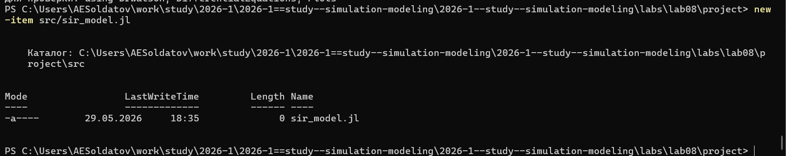{#fig-003 width=70%}

Прописал предложенный код ([рис. @fig-004]).

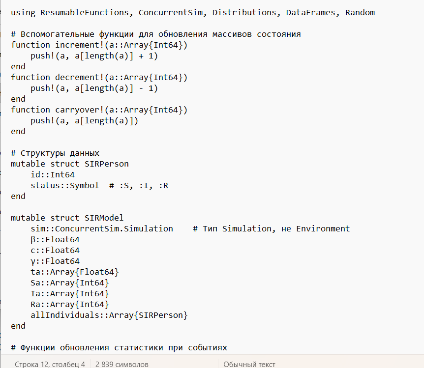{#fig-004 width=70%}

Создал файл для скрипта ([рис. @fig-005]).

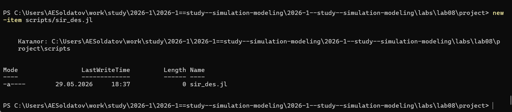{#fig-005 width=70%}

Прописал предложенный код ([рис. @fig-006]).

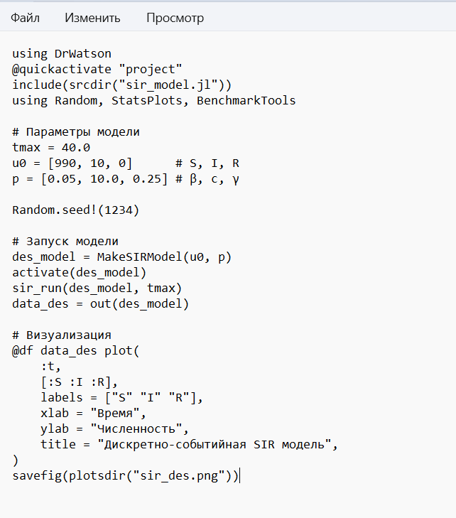{#fig-006 width=70%}

Запустил скрипт, который должен создавать график в папке plots ([рис. @fig-007]).

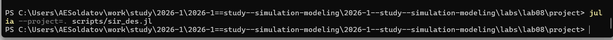{#fig-007 width=70%}

Посмотрел на результат и проанализировал его ([рис. @fig-008]).

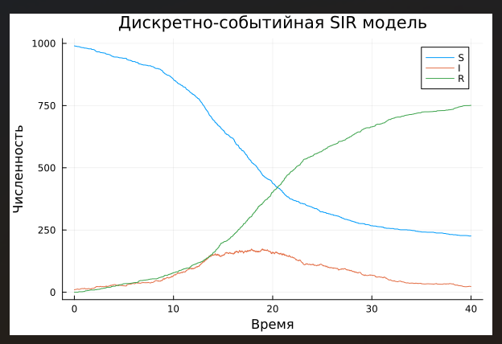{#fig-008 width=70%}

Создал производные форматы ([рис. @fig-009]).

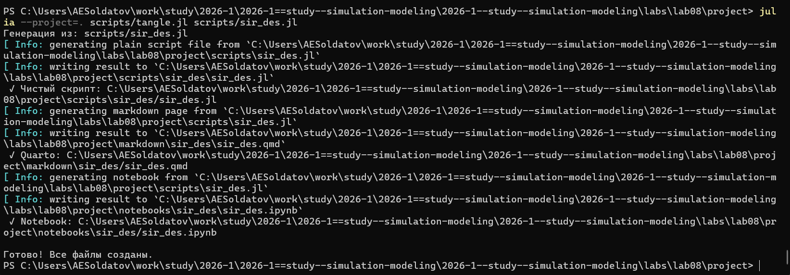{#fig-009 width=70%}

Запустил созданный блокнот ([рис. @fig-010]).

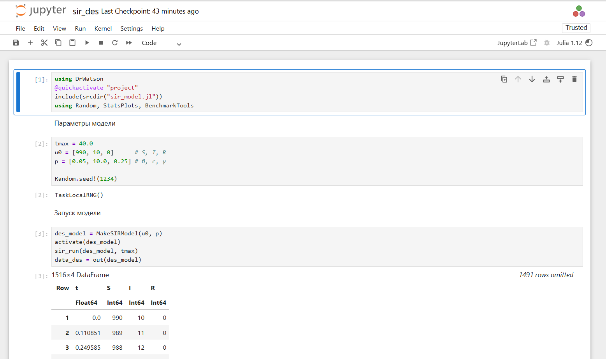{#fig-010 width=70%}

Далее было предложенно модифицировать код, поэтому я создал новый файл, где изменил предыдущий скрипт ([рис. @fig-011]).

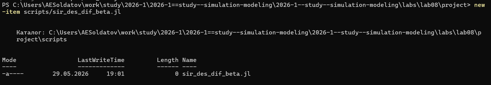{#fig-011 width=70%}

Я в цикле перебирал параметры модели и запускал симуляцию, затем строил график для каждого параметра ([рис. @fig-012]).

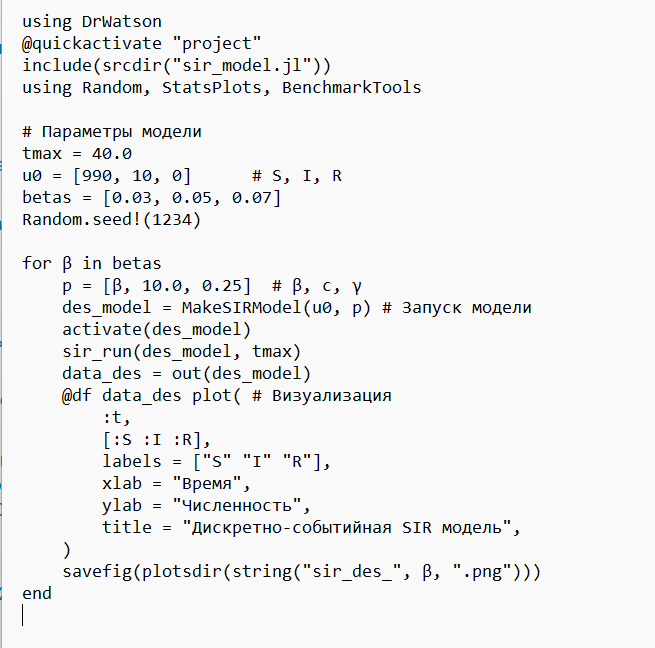{#fig-012 width=70%}

Запустил модифицированный скрипт ([рис. @fig-013]).

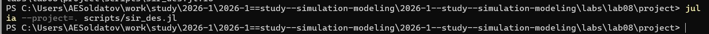{#fig-013 width=70%}

В результате я получил три графика с разными параметрами β ([рис. @fig-014]).

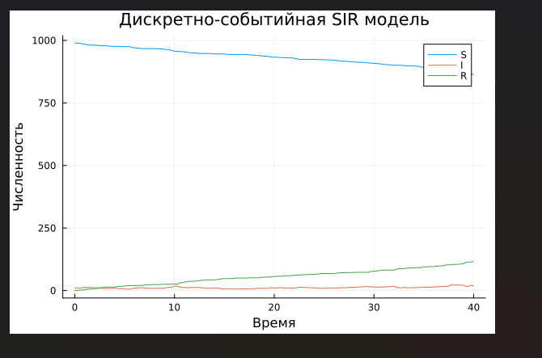{#fig-014 width=70%}

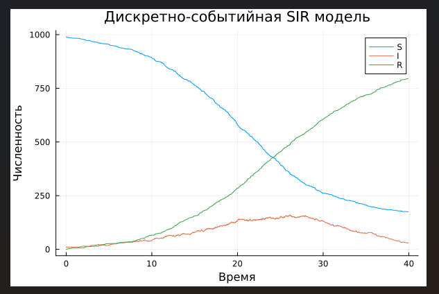{#fig-015 width=70%}

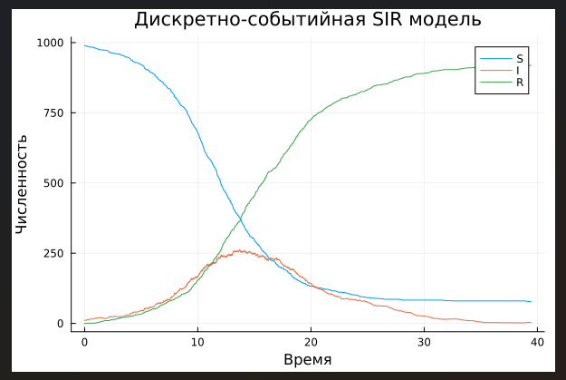{#fig-016 width=70%}

Создал производные форматы для нового скрипта ([рис. @fig-017]).

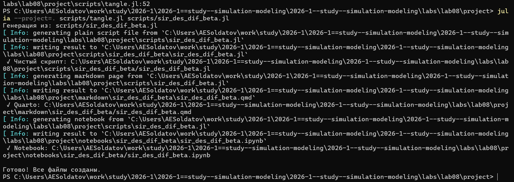{#fig-017 width=70%}

Запустил jupyter notebook ([рис. @fig-018]).

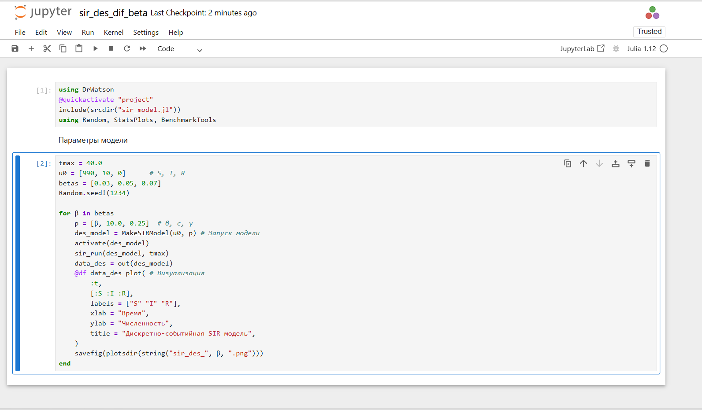{#fig-018 width=70%}

Еще одним дополнительным заданием было посмотреть, что будет, если заменить экспоненциальное время выздоровления на фиксированную величину. Для этого я создал еще один файл модели ([рис. @fig-019]).

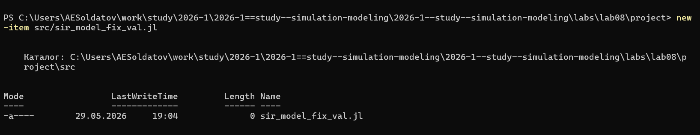{#fig-019 width=70%}

Поменял строку ([рис. @fig-020]).

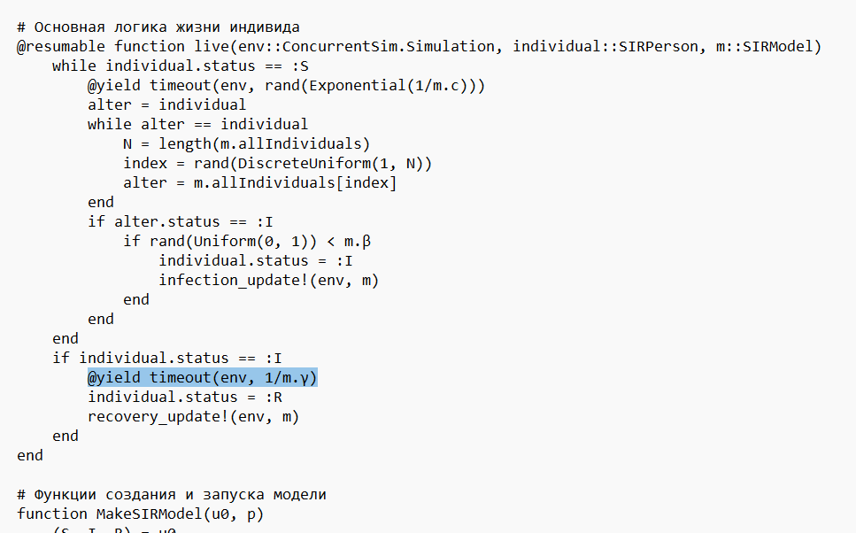{#fig-020 width=70%}

Чтоб была возможность создать графики и для этого эксперимента, я создал новый файл для скрипта, который будет так же перебирать параметры для модифицированной модели ([рис. @fig-021]).

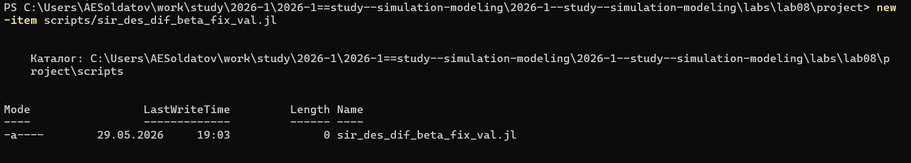{#fig-021 width=70%}

Для этого я прописал код ([рис. @fig-022]).

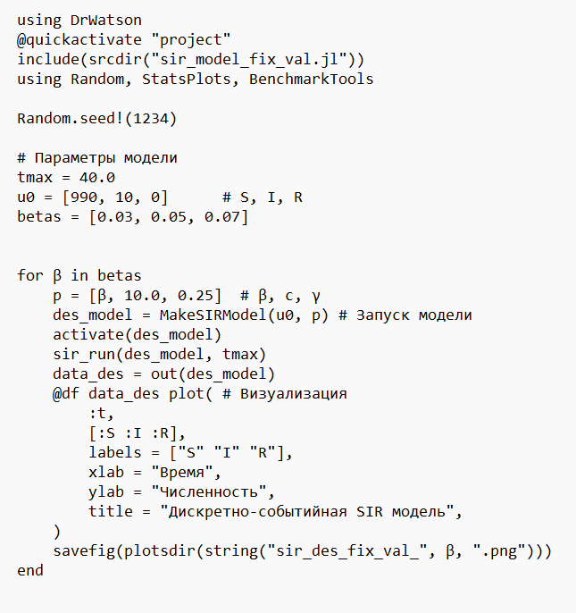{#fig-022 width=70%}

Далее я запустил новый скрипт ([рис. @fig-023]).

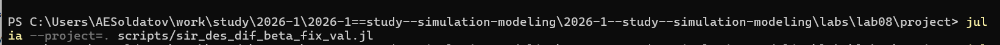{#fig-023 width=70%}

И получил три новых графика ([рис. @fig-024]).

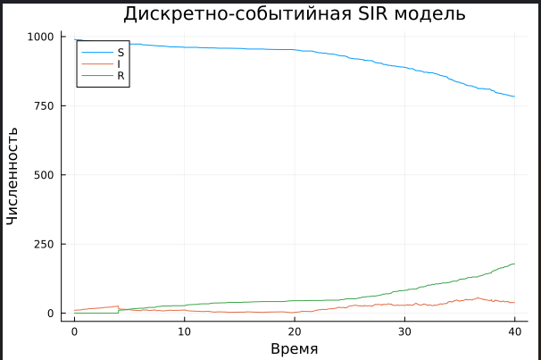{#fig-024 width=70%}

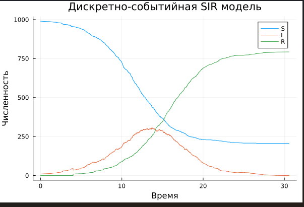{#fig-025 width=70%}

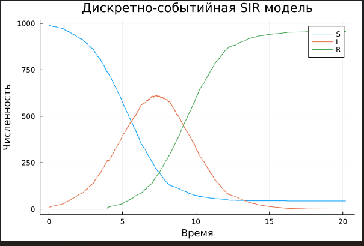{#fig-026 width=70%}

Создал производные форматы ([рис. @fig-027]).

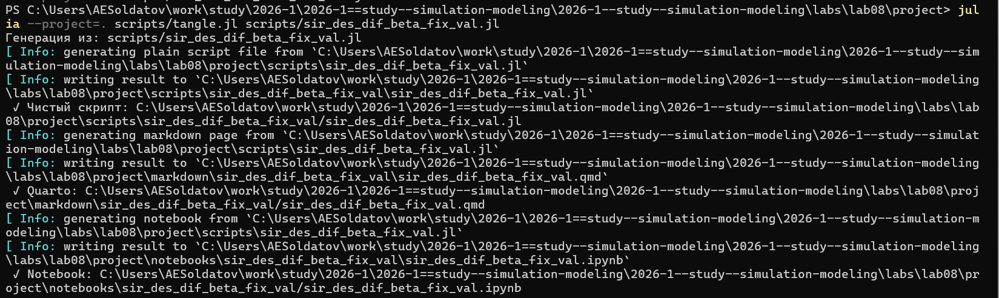{#fig-027 width=70%}

Запустил юпитеровский блокнот ([рис. @fig-028]).

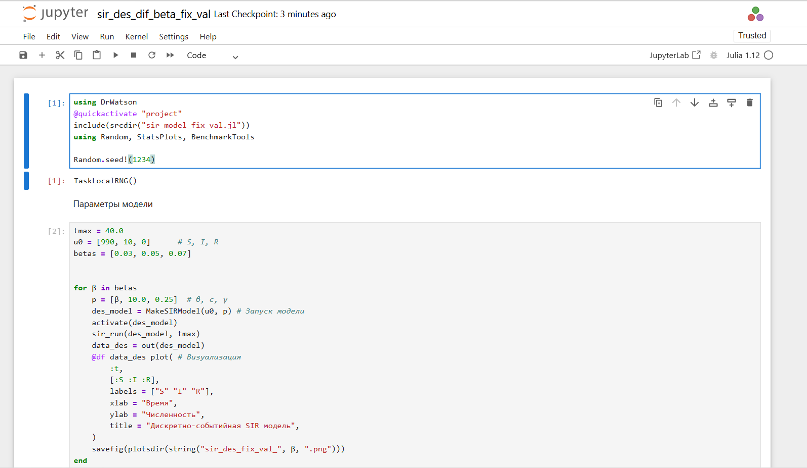{#fig-028 width=70%}

Интегрировал ссылки на Quarto отчеты в репорт ([рис. @fig-029]).

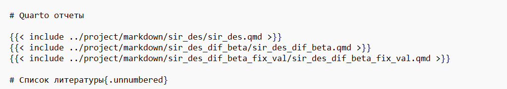{#fig-029 width=70%}

# Выводы

Познакомился с дискретно-событийным моделированием и выполнил несколько дополнительных заданий.

# Quarto отчеты





# Список литературы{.unnumbered}

::: {#refs}
:::
